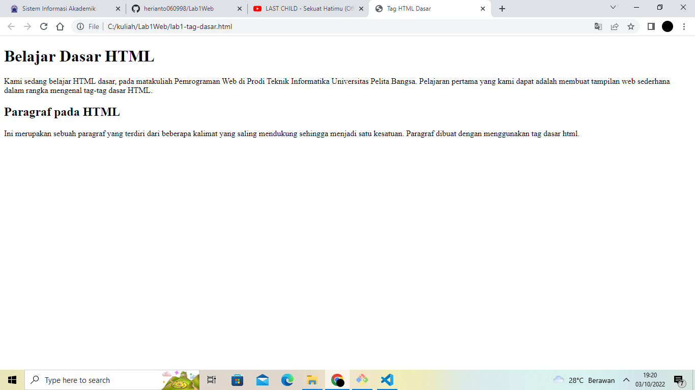

# Lab1Web

# TUGAS 1 
| Nama | kelas | Nim | Matkul |
| -- | --- | ---- | ----------- |
| Heri Anto Simamora | TI.21.B.2| 312110365 | Perograman Web |

## AWAL

## MENAMBAHKAN PARAGRAF

- Paragraf pertama 

- Paragraf kedua 

- Penambahan Atribut Center 

Posisi tulisan menjadi berada di tengah

- Penambahan Atribut Right 

Posisi tulisan menjadi berada disebelah kanan

- Penambahan Atribut Justify

Posisi tulisan menjadi rata kanan - kiri

- Penambhan Atribut Left 

Posisi tulisan menjadi berada disebelah kiri

## MENAMBAHKAN JUDUL 

## MEMFORMAT TEKS 

- Format Bold Text 

- Format Impotant Text

- Format Itallic Text

- Format Emphasized Text

- Format Marked Text 

- Format Smaleer Text

- Format Deleted Text

- Format Inserted Text

- Format Subcript Text

- Format Superscript Text

## MENAMBAHKAN LOGO

## MENAMBAHKAN HYPERLINK 

## PERTAYAAN 

## JAWABAN

- terjadi perubahan jika salah penulisan kode . contoh <a href="#lab1_halaman2.html">Halaman 2</a> disini menggunakan garis bawah sedangkan file yang dibuat tidak menggunakan garis bawah maka halaman 2 tidak bisa dibuka dan terjadi error 
 

- tag (
) dibuat untuk membuat paragraf pada dokumen HTML sedangkan ( ) digunakan untuk break line atau berpindah ke baris selanjutnya 

- attribut (Tittle) digunakan untuk memberi judul pada sebuah gambar yang disisipkan sedangkan (Alt) digunakan untuk mendekripsikan sebuah gambar yang disisipkan

- diisi , agar tinggi dan lebar sebuah gambar mampu proposional di sebuah web yang dibuat dan tidak terjadi hal kurang nyaman dilihat saat web selesai

- pada atribut _blank memuat URL ke dalam konteks meramban baru. Ini biasanya tab, tetapi pengguna dapat mengatur peramban untuk menggunakan jendela baru sebagai gantinya.

pada atribut _self Masukkan URL ke konteks meramban yang sama dengan yang saat ini. Ini adalah perilaku standar

pada atribut _top Muat URL ke dalam konteks meramasian-tingkat atas _self 

pada atribut _parent Masukkan URL ke dalam konteks meramban _parent dari yang saat ini. Jika tidak ada _parent, ini berperilaku dengan cara yang sama seperti _self

