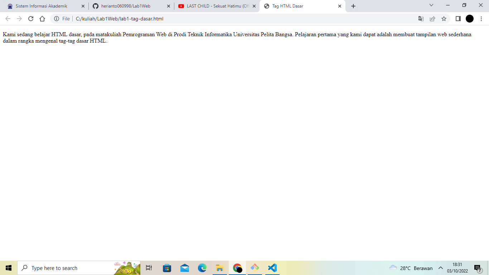
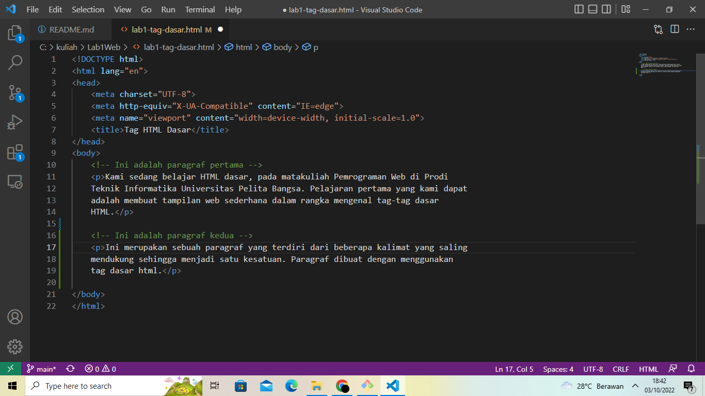

# Lab1Web

# TUGAS 1 
| Nama | kelas | Nim | Matkul |
| -- | --- | ---- | ----------- |
| Heri Anto Simamora | TI.21.B.2| 312110365 | Perograman Web |

## AWAL

## MENAMBAHKAN PARAGRAF

- Paragraf pertama 

- Paragraf kedua 

- Penambahan Atribut Center 

Posisi tulisan menjadi berada di tengah

- Penambahan Atribut Right 

Posisi tulisan menjadi berada disebelah kanan

- Penambahan Atribut Justify

Posisi tulisan menjadi rata kanan - kiri

- Penambhan Atribut Left 

Posisi tulisan menjadi berada disebelah kiri

## MENAMBAHKAN JUDUL 

## MEMFORMAT TEKS 

- Format Bold Text 

- Format Impotant Text

- Format Itallic Text

- Format Emphasized Text

- Format Marked Text 

- Format Smaleer Text

- Format Deleted Text

